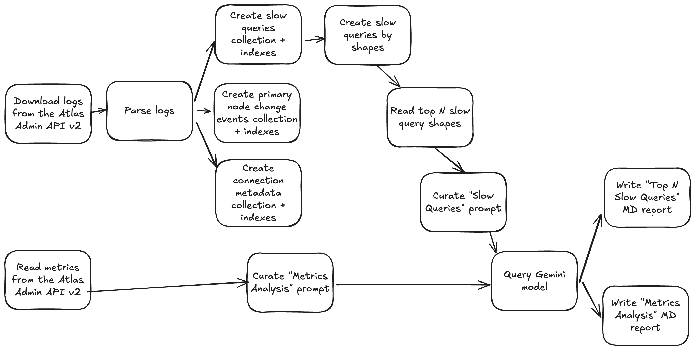

# MongoDB AI Insights

Current POC:



## How to run it

1. Ensure you have a running MongoDB instance. This isn't the analyzed MongoDB cluster -
   just an instance for storing and analyzing intermediate data. You can use [tomodo](https://tomodo.dev) for that.
2. Make a copy of `sample.config.json`:

   ```shell
   cp sample.config.json config.json 
   ```

3. Fill out the missing configuration keys in your `config.json` file. You'll need:

   - Your Gemini API key (see [Gemini API docs](https://ai.google.dev/gemini-api/docs/quickstart))
   - Your Atlas API public and private keys (see [Manage Programmatic Access to a Project](https://www.mongodb.com/docs/atlas/configure-api-access-project/))
   - Your Atlas project ID
   - Your Atlas cluster name
   - The Connection string to your MongoDB instance from step #1 (_not_ your analyzed cluster).

4. Build:

   ```shell
   make build
   ```

5. Run:

   ```shell
   ./dist/mongodb_ai_analyzer
   ```
